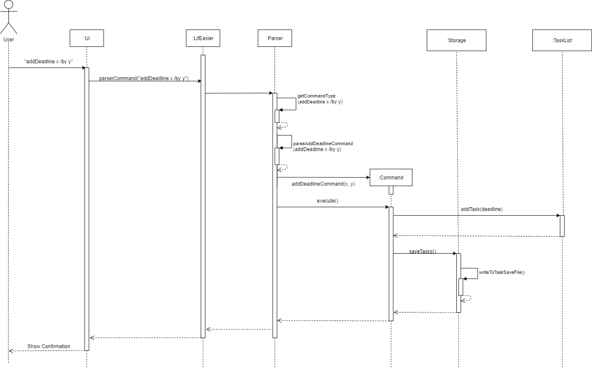
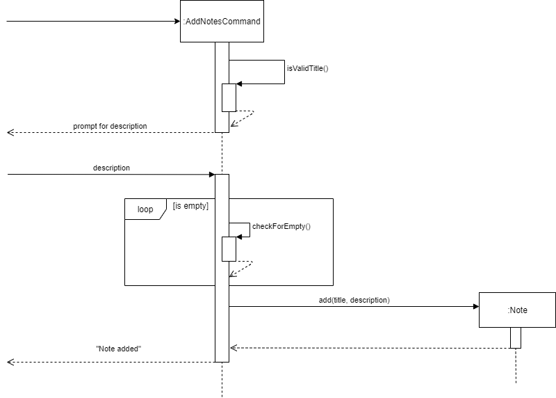
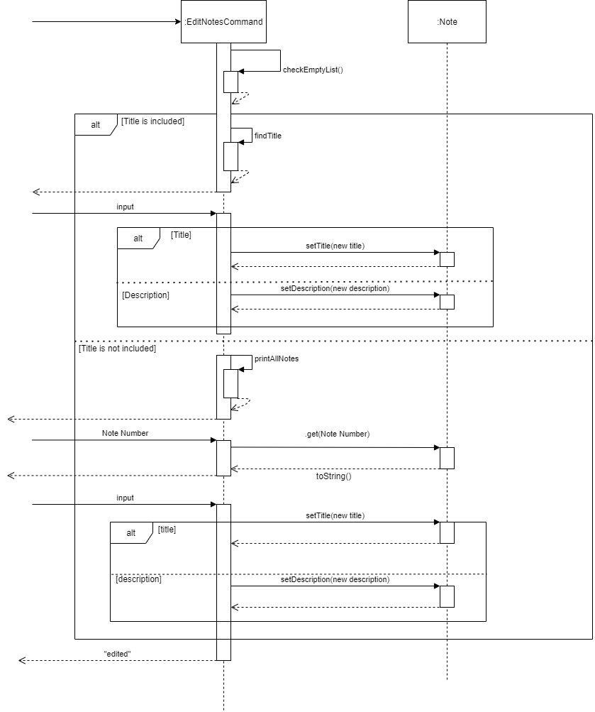
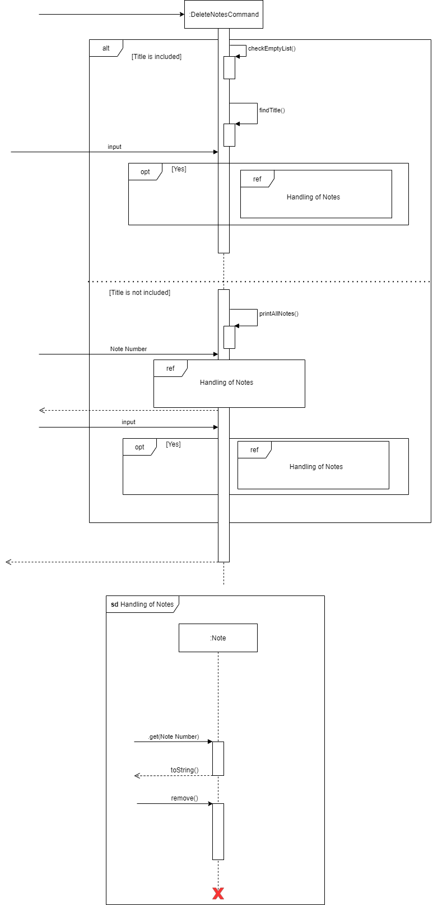
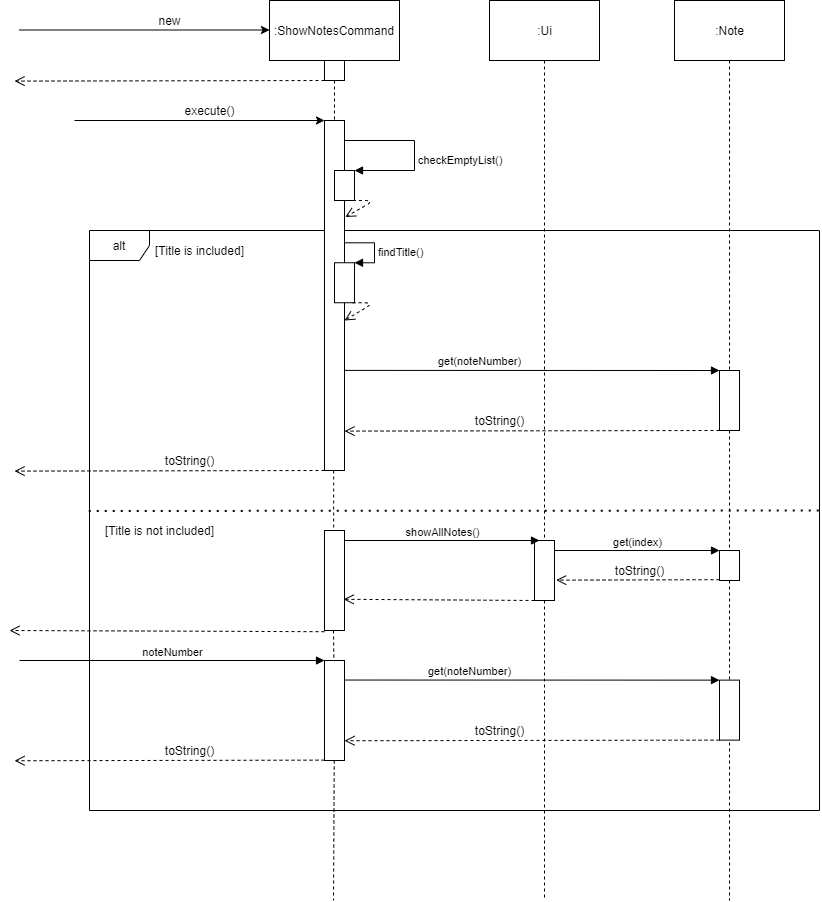
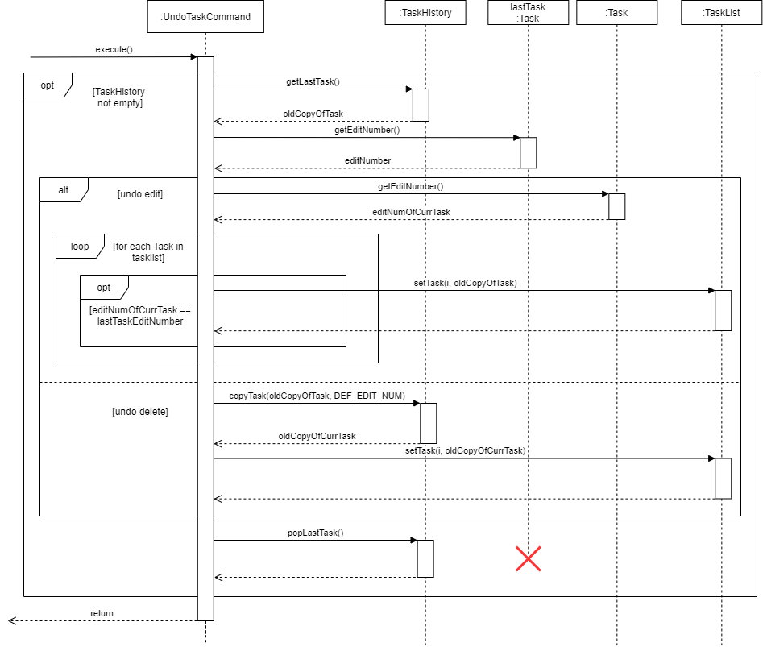
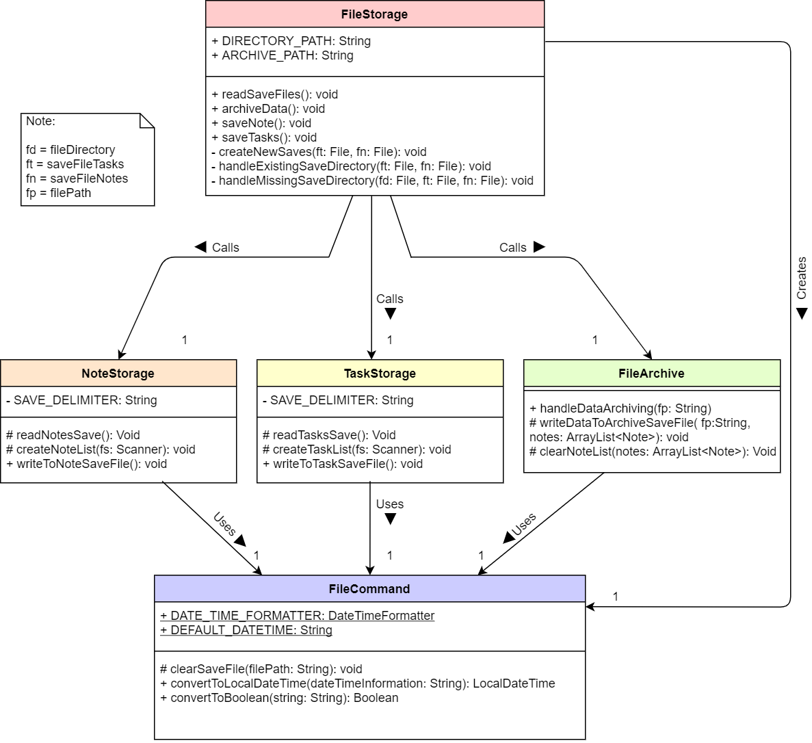
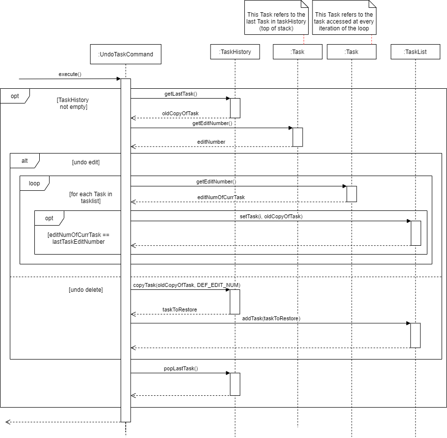
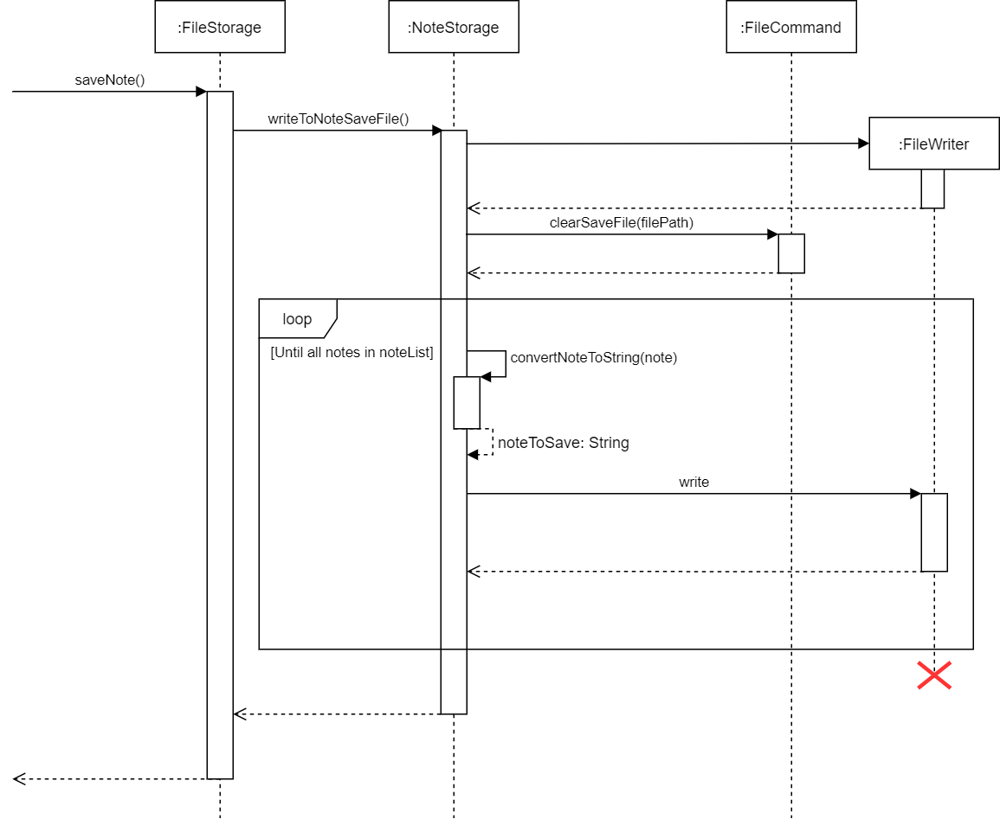
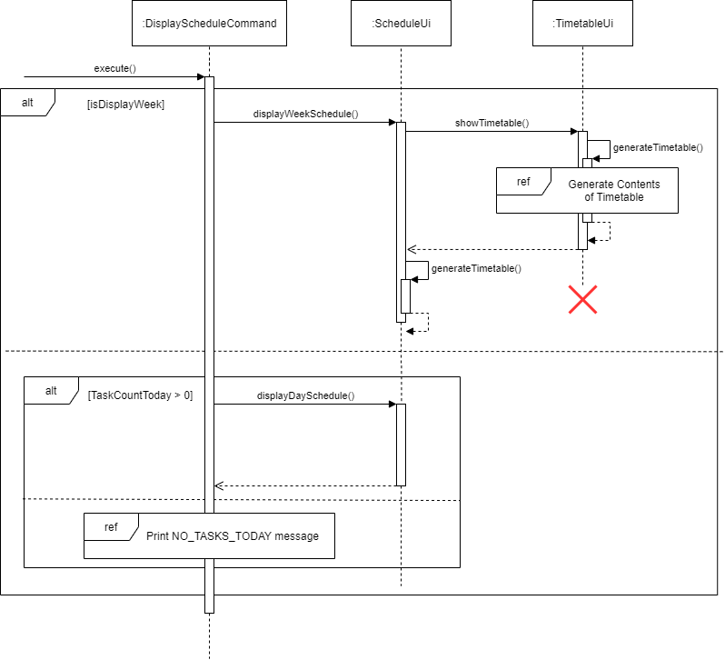

# LifEasier Developer Guide

## Table of Contents

* [1.0 Introduction](#10-introduction)
* [2.0 Setting Up](#20-setting-up)
* [3.0 Design](#30-design)
    * [3.1 Architecture](#31-architecture)
    * [3.2 Components](#32-components)
        * [3.2.1 LifEasier Component](#321-lifeasier-component)
        * [3.2.2 UI Component](#322-ui-component)
        * [3.2.3 Parser Component](#323-parser-component)
        * [3.2.4 Command Component](#324-command-component)
        * [3.2.5 Model Component](#325-model-component)
        * [3.2.6 Storage Component](#326-storage-component)
* [4.0 Implementation](#40-implementation)
    * [4.1 Adding Lessons, Events, Deadlines (Fairuz)](#41-adding-lessons-events-deadlines-fairuz)
    * [4.2 Editing Lessons, Events, Deadlines (Fairuz)](#42-editing-lessons-events-deadlines-fairuz)
    * [4.3 Deleting Lessons, Events, Deadlines (Fairuz)](#43-deleting-of-lessons-events-deadlines-fairuz)
    * [4.4 Adding Notes (Edmund)](#44-adding-notes-edmund)
    * [4.5 Editing and Deleting Notes (Edmund)](#45-editing-and-deleting-notes-edmund)
    * [4.6 Undoing Changes Made to Tasks and Notes (Johannine)](#46-undoing-changes-made-to-tasks-and-notes-johannine)
    * [4.7 Storing and Archiving Notes (Danzel)](#47-storing-and-archiving-notes-danzel)
    * [4.8 Displaying Schedule (Johannine)](#48-displaying-schedule-johannine)
    * [4.9 Displaying Free Time and Sleep Time (Daniel)](#49-displaying-free-time-and-sleep-time-daniel)
    * [4.10 Parsing Commands (Edmund)](#410-parsing-commands-edmund)
    * [4.11 Recurring Tasks and Auto Deletion (Daniel)](#411-recurring-tasks-and-auto-deletion-daniel)
* [5.0 Product Scope](#50-product-scope)
    * [5.1 Target user profile](#51-target-user-profile)
    * [5.2 Value proposition](#52-value-proposition)
* [6.0 User Stories](#60-user-stories)
* [7.0 Non-Functional Requirements](#70-non-functional-requirements)
* [8.0 Documentation](#80-documentation)
* [9.0 Testing / Logging](#90-testing--logging)
* [10.0 Dev Ops](#100-dev-ops)
* [11.0 Glossary](#110-glossary)
* [Appendix A: Project Requirements](#appendix-a-project-requirements)
* [Appendix B: Guidelines on Manual Testing](#appendix-b-guidelines-on-manual-testing)
* [Appendix C: Effort](#appendix-c-effort)

## 1.0 Introduction

**LifEasier** helps Computer Engineering (CEG) students to manage their classes, social events, deadlines and school notes through the Command Line Interface (CLI). **LifEasier** is developed by a group of CEG students for their CS2101/CS2113T mods.

This developer guide documents the design, architecture and instructions for testing, as a reference for developers who will be maintaining or expanding **LifEasier** in the future. 

## 2.0 Setting Up

The following section will provide information on how to set up **LifEasier** for development.

### 2.1 Prerequisites

1. `JDK 11`
2. Intellij IDE

### 2.2 Setting Up the Project

1. Open _IntelliJ_ (if you are not in the welcome screen, click `File` > `Close Project` to close the existing project dialog first).

1. Set up the correct JDK version for Gradle.
Click `Configure` > `Project Defaults` > `Project Structure`
Click `New...` and find the directory of the JDK.

1. Click Import Project.

1. Locate the `build.gradle` file and select it. Click `OK`.

1. Click `Open as Project`.

1. Click `OK` to accept the default settings.

### 2.3 Verifying Setup

1. Run the `seedu.LifEasier.Main` and try a few commands.

1. Run the tests to ensure they all pass. This can be done by executing the command `gradlew build` in _IntelliJ’s_ terminal.


## 3.0 Design

The following sections will go into detail on the design and architecture of **LifEasier**.

### 3.1 Architecture

This section elaborates on the high-level architecture of the **LifEasier** application. It provides a brief introduction to each component, and how these components interact with one another. Figure 3.1-1 provides an overview of the architecture.

 
_Figure 3.1-1 Architecture diagram for LifEasier_

LifEasier is comprised of 7 components, which are listed below together with their functions:

1. `LifEasier`: The main class of the application.
1. `Ui`: Displays messages to the user, and takes in the user’s commands
1. `Parser`: Understands the user’s commands, and creates the necessary Command objects.
1. `Command`: Carries out the user’s command.
1. `Model`: Holds the user's task and note data in memory.
1. `Storage`: Reads and writes data from the hard disk.

Each of these components are expanded on in more detail in their respective sections.

Figure 3.1-2 illustrates the Sequence diagram for how each class interacts with one another through an example  “addDeadline” command.

  
_Figure 3.1-2. Sequence diagram of “addDeadline”._

### 3.2 Components

This section expands on the various components that were first seen in the Architecture section.


#### 3.2.1 LifEasier Component

The **LifEasier** component is the main class of the application. It initialises all other components,
 and is used as the centre of all other components.


#### 3.2.2 UI Component

The `UI` component reads the user’s inputs and displays messages and content to the user. It consists of 3 classes; a main `Ui`,
 a `ScheduleUi` and a `TimetableUi`. The `ScheduleUi` handles all outputs to do with displaying a user’s schedule.
  To do this, it uses the `TimetableUi` to display a specialised timetable view of the weekly schedule. 
  The main `Ui` handles everything else, such as displaying general messages and reading the user’s inputs. 


#### 3.2.3 Parser Component

The `Parser` component takes the user’s inputs from the `Ui` component, and makes sense of these commands. If the
 commands are incomplete, it calls the `Ui` component to prompt the user for more input until the commands have 
 the parameters required to execute. Once this condition is fulfilled, it returns a `Command` object to **LifEasier**
  for the commands to be executed.
  
  
#### 3.2.4 Command Component

The `Command` component consists of an abstract `Command` class and the many different commands that inherit the 
`Command` class. What is important to note is that each type of command class (e.g. `addLessonCommand`, `showNotesCommand`)
 implements an abstract `execute()` method that carries out the command. Figure 3.2.4-1 below shows the classes that 
 inherit from the `Command` class.
 
   
 _Figure 3.2.4-1: The classes that inherit from the Command class_
 
#### 3.2.5 Model Component

The `Model` component contains all the user's notes and tasks in memory. It is comprised of the `TaskList`, `NoteList`, `TaskHistory` and `NoteHistory` classes.
The `TaskList` class handles additions, edits and deletions to the user's tasks, while the `TaskHistory` class allows users to undo their most recent task edits.
Similarly, the `NoteList` class handles additions, edits and deletions to the user's notes, while the `NoteHistory` class allows users to undo their most recent notes edits.
All classes in the `Model` component interact heavilt with the `Command` component as most commands make use of the user's tasks and notes.
 
#### 3.2.6 Storage Component

The `Storage` component handles saving of the users’ notes and tasks to persistent storage.
 It does this after every addition, change, or deletion to the `TaskList` component or `NoteList` component. 
 It also handles the moving of the stored `notes` to a separate `archive` file if instructed.

## 4.0 Implementation

The following section will go into further details on how the different features of **LifEasier** were implemented.

### 4.1 Adding Lessons, Events, Deadlines (Fairuz)

The `addLesson`, `addEvent` and `addDeadline` commands adds the specific task into the `TaskList`.

##### Implementation

Due to the different parameters required by the addition of different types of tasks, each command has
 a specific intended parameter to be input by the user.

For example, if the user uses the `addEvent` command, the user will have to input the `EVENT_NAME`,
 `START_TIME` and `END_TIME`, whereas if the user uses the `addDeadline` command, the user will have input `DEADLINE_NAME` and `BY`.

When the command is called, the class invokes the `TaskList` class method to add the specific task to
 the `TaskList`, after which `Storage` is called to save the updated `TaskList` to the local save file. Figure 4.1-1 shows the 
 sequence diagram for the `addDeadlineCommand`. This sequence diagram is applicable to the other two `addEventCommand` and 
 `addLessonCommand`, with the only difference being in their parameters.
 
   
 _Figure 4.1-1: Sequence diagram for addDeadlineCommand execution_

##### Design Considerations

The success and accuracy of the command is heavily dependent on the values passed to the command by the `Parser` class.
 Thus, checks have to be thoroughly conducted by the `Parser` class before the `Command` class is invoked.

### 4.2 Editing Lessons, Events, Deadlines (Fairuz)

The `editEventCommand`, `editDeadlineCommand` and `editLessonCommand` allows the user to edit existing
 tasks in the `TaskList` according to the type of task.

##### Implementation

These command classes will be invoked when the user inputs the `editTask` command, followed by
 the type of task to be edited. 

The user also has an option to input the task’s name, or part of it, after which **LifEasier**
 will print out all tasks matching the type, and the user query. If the user chooses to leave
 that search parameter blank, **LifEasier** will print out all the tasks of the intended type.
 The program will then prompt User to input the index of the task to be edited.

Upon receiving a valid index of a task to be edited, **LifEasier** will prompt the User for the
 parameter to be edited - `Name` or `Time`. 

Upon receiving a valid option of parameter to edit, **LifEasier** will prompt the User to input
 the new descriptions. If the User input is valid according to the required format, **LifEasier** will print a confirmation
 of the edit. The edited task will then be saved by `Storage`. Figure 4.2-1 illustrates the flow of `editDeadlineCommand` 
 through a sequence diagram. The logic of this class remains the same among the different types of `Tasks`.

    
_Figure 4.2-1: Sequence diagram for editDeadlineCommand execution_

##### Design Considerations

Due to the difference in the types of tasks and their parameters, this functionality was designed to guide the User
 explicitly to ensure accurate inputs and thus efficiency. This will have minimal impact on the efficiency of the program,
 while improving the quality of use for the User.
 
### 4.3 Deleting of Lessons, Events, Deadlines (Fairuz)

The `deleteTaskCommand` allows the user to delete any `Task` (lesson, event or deadline) from the `TaskList`.

##### Implementation
The User first enters the `deleteTask` command and appends the type of task to be deleted. **LifEasier** will then print
 out the list of tasks of the intended type. For example, when User inputs `deleteTask /type event`, **LifEasier** will 
 print out all `Events` in the `TaskList`.

**LifEasier** will then prompt the user to select the `Task` to be deleted by inputting the index of the `Task` as seen from
 the terminal. Before the `Task` is deleted, a temporary copy of the current state of the `Task` will be saved by 
 `TaskHistory`. The `Task` is then deleted and **LifEasier** will print the confirmation of the deletion. The old copy of the 
 `Task` will then be pushed to `TaskHistory`, and the updated `TaskList` will be saved by `Storage`. Figure 4.3 will illustrate 
 the flow of the `deleteTaskCommand` through a sequence diagram.

    
_Figure 4.3-1: Sequence diagram for deleteTaskCommand execution_

##### Design Considerations

The command has to handle separate types of tasks as printing all tasks and forcing the User to look up the whole table
 would be impractical in the long run. The enhanced capability with `TaskHistory` to allow the User to undo any action is 
 crucial as its initial functionality did not have the ability to restore any accidentally deleted `Tasks`.

### 4.4 Adding Notes (Edmund)

The `addNotes` command adds user’s notes to the NoteList with a specified title and description. 

##### Implementation

The `addNotes` command first starts with 2 paths: with or without title. If a title is added alongside the 
“addNotes” (ie. the user inputs “addNotes cats”) then the title is passed on to a method `isValidTitle` that would 
check for a blank input. Conversely, if no title is appended, then the system would prompt the user for the title. 
Either way, the system would still check for if the user inputs an empty title. 
Next, the system would prompt the user for a description. Similar to title, the same method `isValidTitle`, to check 
if the user has inputted an empty String.
Finally, if both title and description are of valid input, then the 2 parameters would be added to the `NoteList` 
and passed on to `NoteStorage`. 

Figure 4.4-1 below illustrates the flow of `addNotes` through a sequence diagram.


_Figure 4.4-1: Sequence diagram for addNotesCommand_


##### Design Considerations

An empty string must be defined clearly (a long string of spaces/no string) and must not be inputted 
by the user as it affects the usability and searchability of the `NoteList`. As such, checks would need to
be implemented to prevent any hiccups by the user.


### 4.5 Editing and Deleting Notes (Edmund)

The `editNotes` command allows the user to change the title or description of their notes stored in the `NoteList`.
The `deleteNotes` command allows the user to remove the specified notes completely from the `NoteList`.

##### Implementation

Below illustrates the steps taken by each command to ensure their execution.

###### editNotes

1. `checkEmptyList` would be called to ensure the `NoteList` is not empty before proceeding on with the execution. 
If an empty list is detected, the command would terminate with a prompt of empty list to the user.
1. A condition of whether the user has pre-inputted the title is checked.
    * If the user pre-inputs a title, the findTitle function would go through the list to find the title. If the input 
    title does not match any of the titles in the list, the command would terminate with a message: 
    “title is not found”. If a match is found, the system prints out the note and asks for which part to edit. 
    In the case of multiple matches, the system would print all matching cases and ask the user to select amongst them. 
    Following the confirmation, a “T” would mean editing the title while “D” would mean editing the description.
    * If the user did not pre-input the title, the system would print all notes currently in the list and ask for 
the user to select which note to edit among them. Following the confirmation, a “T” would mean editing the title 
while “D” would mean editing the description.
       
1. The new edited note would then be passed on to storage for saving.

Figure 4.5-1 illustrates the above steps via a sequence diagram.


_Figure 4.5-1: Sequence diagram for editNotesCommand_

###### deleteNotes

1. checkEmptyList would be called to ensure the NoteList is not empty before proceeding on with the execution. 
If an empty list is detected, the command would terminate with a prompt of empty list to the user.
1. A condition of whether the user has pre-inputted the title is checked.
    * If the user has included a title in the command, the `findTitle` function would go through the list to 
find the title. If the input title does not match any of the titles in the list, the command would terminate with 
a message: “title is not found”. If a match is found, the system prints out the note and asks for confirmation 
for deletion. In the case of multiple matches, the system would print all matching cases and ask the user to select 
amongst them. Following the confirmation, a “N” would terminate the command while a “Y” would proceed to remove 
the note from the list.
    * If the user did not pre-input the title, the system would print all notes currently in the list and ask 
for the user to select which note to delete among them. Following the confirmation for deletion, a “N” would terminate 
the command while a “Y” would proceed to remove the note from the list.

1. The current note list would then be saved by the `Storage` class.

Figure 4.5-2 illustrates the above steps via a Sequence Diagram.


_Figure 4.5-2: Sequence diagram for deleteNotesCommand_

##### Design Considerations

* Any number inputs by the user must be checked through to ensure that it is not out of the available indexes 
in the array. 
* The function must deal with incorrect title inputs by the user. The user cannot input a title that is not found 
in any of the notes nor can he input an invalid title such as an empty string.

* In the event of an empty list, the user cannot delete any more notes from the list. Hence this would result in 
an exception caught.

### 4.6 Undoing Changes Made to Tasks and Notes (Johannine)

The undo feature allows the user to undo any changes made to Task or Note objects, particularly edits and deletions.

##### Implementation

To implement the `undo` feature, the concept of a stack was used to hold all the history of previous versions of `Tasks` 
(or `Notes`) before they are changed.

At every instance where a particular `Task` (or `Note`) is edited or deleted, using commands such as `editDeadline`, 
`deleteTask` or `editNote`, a copy of the `Task` (or `Note`) is made as the changes are being made. Every `Task` or 
`Note` object has an `editNumber` attributed to it, which is assigned a positive value if it has been edited, and a 
negative value if it has been deleted.

The copy made is temporarily stored as a new `Task` (or `Note`) object until the edit or deletion is successful. The 
copy of the old unchanged `Task` (or `Note`) is then pushed into an array called `taskHistory` (or `NoteHistory`), 
which holds all the previous copies of the object.

Figure 4.6-1 illustrates the sequence diagram of the concept above, applied on changes made to a `Task`. The concept 
works in a similar manner for that of `Note` objects.


_Figure 4.6-1: Sequence Diagram for creating and pushing old copies of Tasks_ 

When the `undo` command is called, it retrieves the `editNumber` of the copied `Task` (or `Note`) at the top of the 
stack in `taskHistory` (or `noteHistory`), and iterates through the existing `TaskList` (or `NoteList`) to see which 
`Task` (or `Note`) has the corresponding `editNumber`. If there is a match, the existing `Task` is replaced with the 
old copy, and then the old copy is removed from the `Tasklist`.

The corresponding confirmation message to be displayed is determined by whether the `editNumber` is positive or negative.


_Figure 4.6-2: Sequence Diagram for undoing edits or deletions of Tasks_

##### Design Considerations

To allow for multiple undos on the same `Task` (or `Note`) object, the `editNumber` of `Tasks` (or `Notes`) that have 
been edited before must be checked. If it is anything but the default assigned _value(-999999)_, then its existing 
`editNumber` will be taken and used as the `editID` for all successive copies made of it. This is to allow the 
application to always find the same instance of the `Task` (or `Note`) inside the `TaskList` (or `NoteList`) when 
restoring previous versions.

### 4.7 Storing and Archiving Notes (Danzel)

The storing and saving of data in the **LifEasier** app is done automatically after every change such as adding, editing, 
deleting a component such as a lesson, deadline, event or note. The following section documents how the data storing 
and archiving system of **LifEasier** was implemented, followed by the considerations taken during the design of the storage components.

##### Implementation - Data saving and storing

Figure 4.7-1 shows the simplified class diagram of all the components in the storage package. There are far more methods 
that exist then as shown in the class diagram. These have been omitted for simplicity.


_Figure 4.7-1: Class Diagram for all storage components_

Figure 4.7-2 shows the sequence diagram of the save data reading process which runs whenever **LifEasier** is run. Upon app startup, 
the main `LifEasier` class creates a new `FileStorage` object, which starts the save reading process to load in all the previously stored 
data of the user, if available. Else, new save directories and save files are created in the same directory which the `LifEasier.jar` was run. 
Tasks and notes data read from the save file are used to create new `Task` and `Note` objects respectively, and added into `TaskList` and `NoteList`.


_Figure 4.7-2: Sequence diagram for save data reading on startup_

By default, the save directory is set as _LifEasierSaves_ under the `DIRECTORY_PATH` constant found in the `FileStorage` class. 
The names of the tasks and notes save files are passed in as arguments from the main method in the `LifEasier` class, where the first 
argument dictates the resulting name of the tasks save file, while the second determines the name of the notes save file, as seen from the 
code snippet in figure 4.7-3. Save directory names and paths are **editable**, along with the save file names by changing the values in the locations as stated.

````java
public static void main(String[] args) {
    new LifEasier("saveFileTasks.txt", "saveFileNotes.txt").run(false);
}
````
_Figure 4.7-3: Code snippet for where save file names are set_

Whenever a new task or note is added, edited or deleted, the `saveTask()` or `saveNote()` methods in the `FileStorage` class is called depending 
on whether the changed item was a task or a note, to begin the data saving process. Figure 4.7-4 shows the sequence diagram taken by the program 
to save the user’s notes data. The saving process for tasks and notes are implemented in similar ways, with the saving process for tasks 
requiring a few more additional steps to correctly convert the tasks’ `LocalDateTime` information into formatted Strings to allow for more 
readable save files. The format in which the `LocalDateTime` objects are converted to can be found in the `DateTimeFormatter` object in the 
`FileCommand` class.


_Figure 4.7-4: Sequence diagram for saving of user note data_

##### Implementation - Note Archiving

The `archive` command immediately moves all currently loaded notes into a newly generated text file in the `Archives` directory found within the 
_LifEasierSaves_ directory. If no `Archives` directory is found, it is automatically created. Archive save files are automatically named as the 
current date in the **DD-MM-YY** format, and the time the archive command was run in the **HH:MM** format, separated by a **T**. The current save 
file for notes will be automatically cleared with the `clearSaveFile()` command found in the `FileCommand` class, and the current `noteList` is 
cleared. Archived notes will **not** be read by the program anymore and any changes can be made to the created archive save file.

The `archive` command checks for the size of the current `noteList` before execution, and as such, when an empty `noteList` is detected, 
the archiving process will not be started.

##### Design Considerations

In order to ensure users get the best hassle free and user-friendly experience while using **LifEasier**, saves are automatically done after any change 
that affects any user added tasks and notes. While the constant clearing and rewriting of the save data whenever a change occurs may affect performance 
when the save files get larger, it was decided that the convenience of an automatic saving system outweighs the performance costs, and the assurance 
granted to users that their data is constantly saved without needing their manual intervention.

Saves were also designed to be stored in simple plain text and easily accessible to users to allow experienced users to modify 
the save files directly and easily, if required. 

In the event of **corrupted or missing data**, the `storage` component defends and protects the app from potential issues that might arise from 
reading in this data by throwing exceptions to stop prevent the current data from being read. Any data read up to that point is **untouched**, and the app will 
continue to read in the remaining data and run as per normal. **Manual intervention from the user** is required to remove improperly formatted and/or missing data.  

### 4.8 Displaying Schedule (Johannine)

The `displaySchedule` command presents the `TaskList` contents in a timetable format, given that it is specified to 
display the full week. Otherwise, it displays the current day’s schedule in a list form, with the `Task` items sorted 
by date.


_Figure 4.8-1: Sequence diagram for displaying week or day schedule_

##### Implementation

The timetable is structured in such a way that the first column always starts with the schedule of the current day, 
followed by that of the next 6 days. This is so that the user always sees 7 days ahead, rather than a typical fixed 
format _(e.g. from Monday to Sunday)_.

Changes to the timetable are updated at every call of the `showTimetable()` method, which first involves the generation 
of the timetable by loading the contents of the `TaskList` into it, then printing it row by row.

The timetable is modelled using an `ArrayList`, with each entry containing a row of the timetable as a string. The 
individual cell entries of the timetable are collected by iterating through each day, each time slot and then through 
the `TaskList` to see which tasks fall on that particular day and are held during that particular time slot.

The cell entries which fall on the same time slot and hence the same row, are collected into an array and formatted into 
a string, before it is finally added to the `ArrayList` of timetable rows.

##### Design Considerations

To ensure that the displayed timetable is easy to read and offers a quick view of the user’s schedule, especially that 
of the current day, the timetable is not made to be fixed. The display schedule commands must thus iterate through the 
entire `TaskList` every time it is called, in order to arrange the `Tasks` accordingly and update any changes.

Because of the way the timetable time slots increment on an hourly basis, functions were implemented to ensure the 
timings of `Tasks` were rounded to the hour. This was an intentional design choice to keep the timetable neat and not 
overloaded with too much details.

### 4.9 Displaying Free Time and Sleep Time (Daniel)

##### Implementation

The `freeTime` command displays to the user their longest block of free time for that day. The `sleepTime`
 command displays to the user how much time they have available to sleep based on that day’s and the
 next day’s schedule. Both commands are implemented similarly. They both find the longest uninterrupted block
 of free time within a certain time period by checking if individual hour-long time blocks in this time period
 are free. The commands then use the start and end time values found to calculate a duration, and pass all
 three values to the Ui to display to the user. Figure 4.9-1 shows the sequence diagram for the `freeTimeCommand`,
 and Figure 4.9-2 shows the sequence diagram for the `sleepTimeCommand`.

  
_Figure 4.9-1: Sequence diagram for freeTimeCommand execution_


  
_Figure 4.9-2: Sequence diagram for sleepTimeCommand execution_

##### Design Considerations

1. Because of the way that the `TaskList` stores `Tasks` in an unsorted way, the  `freeTime` and `sleepTime` commands
 must iterate through the entire list every time to check if a particular time slot has nothing scheduled.
 This corresponds to a time complexity of O(N). This was chosen as the way to implement this function as the
 size of `TaskList` is relatively small. As such, the repeated iteration would not result in 
 significant impacts on the timing performance.
 
1. The functions also only provide an accuracy resolution which is rounded to the hour. Similar to the `displaySchedule`
 command, this was an intentional design choice to not overload the user with too many unnecessary details. 


### 4.10 Parsing Commands (Edmund)

The `Parser` determines what command is to be executed given by the user input. If the user input does not match any of 
the specified commands, an unknown command message would be returned.

##### Implementation

The type of command is determined by the parser through the first string of the input and passed through a switch 
statement. If it matches with any of the cases, the corresponding `parse` command would be executed. Otherwise, it would 
return an invalid command. The corresponding parsers would check whether all parameters are inputted before passing 
them into their respective commands. This is done by checking the user input for any missing initials (/code, /time, etc.) 
and appending any of these missing parameters into a new string with all the parameters present. With the required 
parameters filled, the corresponding parser would pass them to their command functions.	

##### Design Considerations

The user cannot input an empty string as a parameter. This would avoid issues of invalid parameters passing on to the 
commands, which can result in error in the program. As such, checks are to be done on the user input.  

### 4.11 Recurring Tasks and Auto Deletion (Daniel)

##### Implementation

Every time **LifEasier** starts up, it automatically updates the dates of recurring tasks, and deletes tasks that are 
in the past and no longer set to repeat. **LifEasier** performs this step after loading the tasks and notes from the
save files into NoteList and TaskList. It does so by iterating through the list, and checking the `start` variable
 of each task. If the date of `start` is before the current date, the `recurrences` variable is checked. If 
 `recurrences = 0`, the task is deleted. Else, the task's date is moved forward by 1 week and `recurrences` is 
decremented by 1 until the date of `start` is on or after the current date, or `recurrences` hits 0.


##### Design Considerations

1. **LifEasier** only updates tasks on startup, instead of after every command. This was done intentionally to ensure
that each command does not take too much time to run. However, if a user keeps **LifEasier** open over the course of a
few days, they might need to restart it to ensure that their tasks are updated.


## 5.0 Product Scope

### 5.1 Target user profile

NUS Computer Engineering students who struggle with keeping track of classes and deadlines, and managing their time to 
have a social life with their busy schedule.
 
### 5.2 Value proposition

**LifEasier** is a timetabling application with added abilities to add their own reminders and social events designed to
 help students keep track of everything that they need to do. The application could help them take down and organise 
 their notes as well.
 
This will make their lives easier as they can more accurately keep track of what they are supposed to do, and what they 
have already completed.

## 6.0 User Stories

|Version| As a ... | I want to ... | So that I can ...|
|--------|----------|---------------|------------------|
|v1.0|first time user|be able to access help to see what commands are available|learn to use the app|
|v1.0|student|be able to add additional classes to the timetable|create my timetable with the relevant information|
|v1.0|student|be able to take down notes and have them organised|have an easy way to take down notes during lecture|
|v1.0|forgetful student|be reminded of my upcoming deadlines|be on time for all my deadlines|
|v1.0|frequent user|know what I have going on for the day and when|I can have some motivation to start the day right|
|v1.0|frequent user|be reminded of my regular weekly activities|keep track of the time I need to prepare for classes/homework|
|v1.0|intermediate user|be able to enter detailed information into command|the app can help keep track of more details for me|
|v2.0|student|be able to tell how much free time I have in the day|time manage my activities better|
|v2.0|forgetful student|schedule one time events according to my timetable|avoid  manually deleting events from the calendar when they are over|
|v2.0|tired student|be able to tell how much sleep I can get|plan my sleep schedule and be less tired|
|v2.0|lazy user|edit my events and classes as they change|avoid having to delete and add them again|
|v2.0|disorganised user|have the application recommend me the time I can do my personal stuff|avoid spending too much time planning|
|v2.0|frequent user|have a way to edit the notes I have taken|update any additional information in the future|
|v2.0|frequent user|be able to have quick access to all related notes of a subject|will be able to revise more efficiently|
|v2.0|intermediate user|set recurring events / classes|avoid having to repeat multiple commands for the same thing|
|v2.0|long time user|be able to store/archive different semester schedule and notes|show it to my descendants|
|v2.0|experienced user|have a way to delete unwanted tasks|remove clutter|

## 7.0 Non-Functional Requirements

1. The application should work on any mainstream OS that has Java 11 or above installed.
1. The application has to be lightweight and can be used on a device with storage issues.
1. The application does not end abruptly when invalid inputs are passed.
1. The file size of the application is below 100MB.

## 8.0 Documentation

Apart from the User Guide and Developer Guide managed under the`/docs` folder, there are also separate PDF versions maintained.
However, the versions available in the `/docs` folder. should be the most updated. The project uses GitHub Pages and Jekyll to generate formatted static websites to host the User Guide and Developer Guide.


## 9.0 Testing / Logging

The project makes use of Gradle and JUnit5 for testing. There are two ways that tests can be run, which are elaborated
 below.

1. Using the IntelliJ JUnit test runner: To test the entire project, navigate to the `src/test/java/seedu.lifeasier` 
folder and right click on it, and select `Run Tests in ‘seedu.life…’`. The option to run tests with coverage is also 
listed.To run tests on a particular subset, you can right click on any test package, test class, or test method and
select `Run`.
2. Using Gradle: In the terminal, run the command `gradlew clean test` for Windows, or `./gradlew clean test` for Mac
 and Linux. This will run all tests.

The project uses the `java.util.logging` package for logging. Each class uses its own `Logger` object to log the 
necessary messages. Logging can be enabled or disabled through the use of the `logging boolean` when calling
the `LifEasier.run()` method. Setting `showLogging` to `true` will enable logging, and setting it to `false` will 
disable logging.

The project also has the option to make use of the `text-ui-test` folder to perform IO redirection tests.
However, this option is not currently recommended due to the hassle of configuring these tests to work with save files which might change every iteration of testing.

## 10.0 Dev Ops

The project uses Gradle for build automation and dependency management. More information on how to use
 Gradle can be found [here](https://se-education.org/guides/tutorials/gradle.html).

The project also uses Github Actions for Continuous Integration (CI). The configurations file can be found in
the `.github/workflows` folder. No actions regarding configuration are currently required, but this file can be
edited in future to change the configurations if necessary.

## 11.0 Glossary

* *glossary item* - Definition

## Appendix A: Project Requirements

## Appendix B: Guidelines on Manual Testing

Refer to the **LIfEasier User Guide** [here](https://ay2021s1-cs2113t-w13-4.github.io/tp/UserGuide), for the setting up/quick start guide and to view more detailed information of all usable commands. 
After launching the **LifEasier** app, the tester can run the `help` command to display the list of available commands.

The following are some sample commands to add new tasks and notes into **LifEasier**. Please note that some commands are _partial commands_, where incomplete command 
parameters are allowed. Please refer to the user guide linked above for more information on which commands support _partial commands_.
* `addLesson /code CS2113T /date 28-10-20 /time 14:00 /to 16:00 /repeats 10`
* `addLesson /code CS2101`
* `addEvent CS2101 Presentation /date 30-10-20 /time 09:00 /to 12:00 /repeats 5`
* `addDeadline Buy some Bread /by  31-01-20 22:00 /repeats 0`
* `addNotes`
* `addNotes Cats are the best!`

Use the following commands to test the display schedule function:
* `display week`
* `display`

To view currently saved notes, you can use either of the following commands.
* `showNotes`
* `showNotes Cats`

All tasks and notes are editable. Use the following sample commands to test the implemented edit feature.
* `editLesson CS2113T`
* `editEvent CS2101 Presentation`
* `editDeadline Buy some Bread`
* `editNotes`
* `editNotes Cats`

**LifEasier** sports an undo function, which allows you to undo edits and deletions made to tasks and notes.
At any point, feel free to try out the undo command after an edit or delete has been made. Use the following sample commands to test the undo feature.
* `undo task`
* `undo note`

Once again, use the `display` and `showNotes` commands to view the updated tasks and notes contents.

At any point, feel free to quit the app using `exit` and relaunch the app to view that **LifEasier** has saved all input data.

Test deletion of tasks and notes with the following commands.
* `deleteTask /type lesson /CS2113T`
* `deleteTask /type event`
* `deleteNotes`
* `deleteNotes Cats` 

Use the following command to archive all currently loaded notes.
* `archive`

Now, when `showNotes` is used, there should be no notes listed. Navigate to the _LifEasierSaves_ directory created in the same folder as `LifEasier.jar` was run, to find the created _Archives_ directory. Your archived notes will be found in the created text file named corresponding to the date and time the archive command was run.

To show free time and sleep time, use the following commands.
* `freeTime`
* `sleepTime`

Following the above path for manual testing will bring you through all the features implemented in the current version of **LifEasier**. Please feel free to try out other combinations of inputs to fully test the program.


## Appendix C: Effort

On average, the development team met up twice a week to merge finished work, bug test, and do minor bug fixes before continuing to discuss design moving forward, new features to be implemented and handing out new issues. 

Overall, the average individual effort was higher than that of the individual project. This is because we underestimated the difficulty of working in a team, and the amount of time needed to create the User Guide and Developer Guide. 
