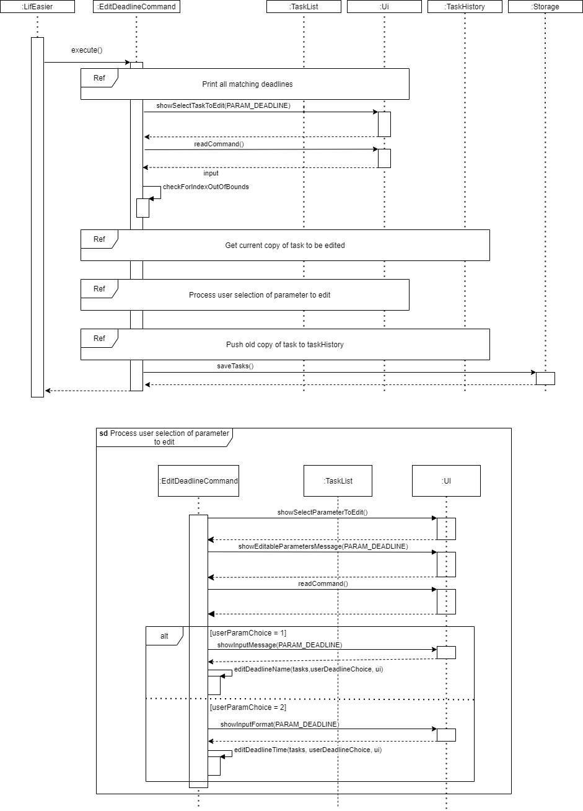
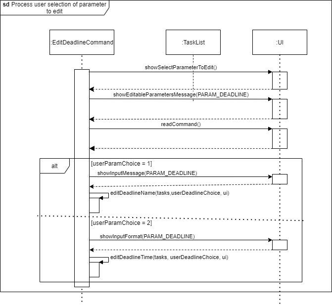

# LifEasier Developer Guide

## Table of Contents
* [1.0 Introduction](#10-introduction)
* [2.0 Setting Up](#20-setting-up)
* [3.0 Design](#30-design)
    * [3.1 Architecture](#31-architecture)
    * [3.2 Components](#32-components)
        * [3.2.1 LifEasier Component](#321-lifeasier-component)
        * [3.2.2 UI Component](#322-ui-component)
        * [3.2.3 Parser Component](#323-parser-component)
        * [3.2.4 Command Component](#324-command-component)
        * [3.2.5 TaskList Component](#325-tasklist-component)
        * [3.2.6 NoteList Component](#326-notelist-component)
        * [3.2.7 Storage Component](#327-storage-component)
* [4.0 Implementation](#40-implementation)
    * [4.1 Adding Lessons, Events, Deadlines (Fairuz)](#41-adding-lessons-events-deadlines-fairuz)
    * [4.2 Editing and Deleting Lessons, Events, Deadlines (Fairuz)](#42-editing-and-deleting-lessons-events-deadlines-fairuz)
    * [4.3 Adding Notes (Edmund)](#43-adding-notes-edmund)
    * [4.4 Editing and Deleting Notes (Edmund)](#44-editing-and-deleting-notes-edmund)
    * [4.5 Storing and Archiving Notes (Danzel)](#45-storing-and-archiving-notes-danzel)
    * [4.6 Displaying Schedule (Johannine)](#46-displaying-schedule-johannine)
    * [4.7 Displaying Free Time and Sleep Time (Daniel)](#47-displaying-free-time-and-sleep-time-daniel)
    * [4.8 Parsing Commands (Edmund / Daniel?)](#48-parsing-commands-edmund--daniel)
* [5.0 Product Scope](#50-product-scope)
    * [5.1 Target user profile](#51-target-user-profile)
    * [5.2 Value proposition](#52-value-proposition)
* [6.0 User Stories](#60-user-stories)
* [7.0 Non-Functional Requirements](#70-non-functional-requirements)
* [8.0 Documentation](#80-documentation)
* [9.0 Testing / Logging](#90-testing--logging)
* [10.0 Dev Ops](#100-dev-ops)
* [11.0 Glossary](#110-glossary)

## 1.0 Introduction

## 2.0 Setting Up

## 3.0 Design
### 3.1 Architecture
### 3.2 Components
This section expands on the various components that were first seen in the Architecture section.

#### 3.2.1 LifEasier Component
The LifEasier component is the main class of the application. It initialises all other components,
 and is used as the centre of all other components.

#### 3.2.2 UI Component
The UI component reads the user’s inputs and displays messages and content to the user. It consists of a main Ui,
 a ScheduleUi and a TimetableUi. The ScheduleUi handles all outputs to do with displaying a user’s schedule.
  To do this, it uses the TimetableUi to display a specialised timetable view of the weekly schedule. 
  The main Ui handles everything else, such as displaying general messages and reading the user’s inputs. 

#### 3.2.3 Parser Component
The Parser component takes the user’s inputs from the Ui component, and makes sense of these commands. If the
 commands are incomplete, it calls the Ui component to prompt the user for more input until the commands have 
 the parameters required to execute. Once this condition is fulfilled, it returns a Command object to LifEasier
  for the commands to be executed.
  
  
#### 3.2.4 Command Component
The Command component consists of an abstract Command class and the many different commands that inherit the 
Command class. What is important to note is that each type of command class (e.g. addLessonCommand, showNotesCommand)
 implements an abstract execute() method that carries out the command. Figure 3.2.4-1 below shows the classes that 
 inherit from the Command class.
 
 *Figure 3.2.4-1: The classes that inherit from the Command class*
 
#### 3.2.5 TaskList Component

The TaskList component handles the instantiation and modifications to the overall list of tasks. Specifically,
 it handles any addition, edition, deletion on the TaskList. This component will heavily interact with the Command 
 component as most commands will include modifications to the overall TaskList.
 
 
#### 3.2.6 NoteList Component
The NoteList component contains all the users notes. Similar to the TaskList component, it interacts heavily with 
the Command component to modify the user’s notes.

#### 3.2.7 Storage Component
The Storage component handles saving of the users’ notes and tasks to persistent storage.
 It does this after every addition, change, or deletion to the TaskList component or NoteList component. 
 It also handles the moving of the stored notes to a separate archive file if instructed.

## 4.0 Implementation
### 4.1 Adding Lessons, Events, Deadlines (Fairuz)
The addLesson/addEvent/addDeadline command adds the specific task into the TaskList.
##### Implementation
Due to the different parameters required by the addition of different types of tasks, each command has
 a specific intended parameter to be input by the user.

For example, if the user uses the addEvent command, the user will have to input the EVENT_NAME,
 START_TIME and END_TIME, whereas if the user uses the addDeadline command, the user will have input DEADLINE_NAME and BY.

When the command is called, the class invokes the TaskList class method to add the specific task to
 the TaskList, after which Storage is called to save the updated TaskList to the local save file. Figure 4.1-1 shows the 
 sequence diagram for the addDeadlineCommand. This sequence diagram is applicable to the other two addEventCommand and 
 addLessonCommand, with the only difference being in their parameters.
 
   
 _Figure 4.1-1: Sequence diagram for addDeadlineCommand execution_

##### Design Considerations
The success and accuracy of the command is heavily dependent on the values passed to the command by the Parser class.
 Thus, checks have to be thoroughly conducted by the Parser class before the Command class is invoked.
### 4.2 Editing Lessons, Events, Deadlines (Fairuz)
The editEventCommand, editDeadlineCommand and editLessonCommand allows the user to edit existing
 tasks in the TaskList according to the type of task.
##### Implementation
These command classes will be invoked when the user inputs the editTask command, followed by
 the type of task to be edited. 

The user also has an option to input the task’s name, or part of it, after which LifEasier
 will print out all tasks matching the type, and the user query. If the user chooses to leave
 that search parameter blank, LifEasier will print out all the tasks of the intended type.
 The program will then prompt User to input the index of the task to be edited.

Upon receiving a valid index of a task to be edited, LifEasier will prompt the User for the
 parameter to be edited - Name or Time. 

Upon receiving a valid option of parameter to edit, LifEasier will prompt the User to input
 the new descriptions. If the User input is valid according to the required format, LifEasier will print a confirmation
 of the edit. The edited task will then be saved by Storage. Figure 4.2-1 illustrates the flow of editDeadlineCommand 
 through a sequence diagram. The logic of this class remains the same among the different types of Tasks.

  
  
_Figure 4.2-1: Sequence diagram for editDeadlineCommand execution_

##### Design Considerations
Due to the difference in the types of tasks and their parameters, this functionality was designed to guide the User
 explicitly to ensure accurate inputs and thus efficiency.
 
### 4.3 Deleting of Lessons, Events, Deadlines (Fairuz)
The deleteTaskCommand allows the user to delete any task (lesson, event or deadline) from the TaskList.
##### Implementation
The User first enters the deleteTask command and appends the type of task to be deleted. LifEasier will then print
 out the list of tasks of the intended type. For example, when User inputs “deleteTask /type event”, LifEasier will 
 print out all Events in the TaskList.

LifEasier will then prompt the user to select the Task to be deleted by inputting the index of the Task as seen from
 the terminal. Before the Task is deleted, a temporary copy of the current state of the Task will be saved by 
 TaskHistory. The Task is then deleted and LifEasier will print the confirmation of the deletion. The old copy of the 
 Task will then be pushed to TaskHistory, and the updated TaskList will be saved by Storage. Figure 4.3 will illustrate 
 the flow of the deleteTaskCommand through a sequence diagram.

##### Design Considerations
The command has to handle separate types of tasks as printing all tasks and forcing the User to look up the whole table
 would be impractical in the long run. The enhanced capability with TaskHistory to allow the User to undo any action is 
 crucial as its initial functionality did not have the ability to restore any accidentally deleted Tasks.

    
_Figure 4.3-1: Sequence diagram for deleteTaskCommand execution_
### 4.3 Adding Notes (Edmund)

The addNotes command adds user’s notes to the NoteList with a specified title and description. 

#####Implementation
The addNotes command first starts with 2 paths: with or without title. If a title is added alongside the 
“addNotes” (ie. the user inputs “addNotes cats”) then the title is passed on to a method (isValidTitle) that would 
check for a blank input. Conversely, if no title is appended, then the system would prompt the user for the title. 
Either way, the system would still check for if the user inputs an empty title. 
Next, the system would prompt the user for a description. Similar to title, the same method (isValidTitle), to check 
if the user has inputted an empty String.
Finally, if both title and description are of valid input, then the 2 parameters would be added to the NoteList 
and passed on to NoteStorage. Figure 4.4 illustrates the flow of addNotes through a sequence diagram.

![Figure 4.4-1][(images/DeveloperGuide/Figure 4.4-1.png)
_Figure 4.4-1: Sequence diagram for addNotesCommand

#####Design Considerations
An empty string must be defined clearly (a long string of spaces/no string) and must not be inputted 
by the user as it affects the usability and searchability of the NoteList. As such, checks would need to
be implemented to prevent any hiccups by the user.

### 4.4 Editing and Deleting Notes (Edmund)
The editNotes command allows the user to change the title or description of their notes stored in the NoteList.
The deleteNotes command allows the user to remove the specified notes completely from the NoteList.

#####Implementation
Below illustrates the steps taken by each command to ensure their execution.
######editNotes
1. checkEmptyList would be called to ensure the NoteList is not empty before proceeding on with the execution. 
If an empty list is detected, the command would terminate with a prompt of empty list to the user.
2. A condition of whether the user has pre-inputted the title is checked.
#######a. If the user pre-inputs a title, the findTitle function would go through the list to find the title. 
If the input title does not match any of the titles in the list, the command would terminate with a 
message: “title is not found”. If a match is found, the system prints out the note and asks for which part to edit. 
In the case of multiple matches, the system would print all matching cases and ask the user to select amongst them.
Following the confirmation, a “N” would terminate the command while a “Y” would proceed to ask which part of the note 
would the user like to edit. “T” would mean editing the title while “D” would mean editing the description.
#######b. If the user did not pre-input the title, the system would print all notes currently in the list and ask for 
the user to select which note to edit among them. Following the confirmation for edit, a “N” would terminate the command 
while a “Y” would proceed to ask which part of the note would the user like to edit. “T” would mean editing the title 
while “D” would mean editing the description.
       
3. The new edited note would then be passed on to storage for saving.

Figure 4.5-1 illustrates the above steps via a sequence diagram.
![Figure 4.5-1][(images/DeveloperGuide/Figure 4.5-1.png)
_Figure 4.5-1: Sequence diagram for editNotesCommand

######editNotes
1. checkEmptyList would be called to ensure the NoteList is not empty before proceeding on with the execution. 
If an empty list is detected, the command would terminate with a prompt of empty list to the user.
2. A condition of whether the user has pre-inputted the title is checked.
#######a. If the user has included a title in the command, the findTitle function would go through the list to 
find the title. If the input title does not match any of the titles in the list, the command would terminate with 
a message: “title is not found”. If a match is found, the system prints out the note and asks for confirmation 
for deletion. In the case of multiple matches, the system would print all matching cases and ask the user to select 
amongst them. Following the confirmation, a “N” would terminate the command while a “Y” would proceed to remove the 
note from the list.
#######b. If the user did not pre-input the title, the system would print all notes currently in the list and ask 
for the user to select which note to delete among them. Following the confirmation for deletion, a “N” would terminate 
the command while a “Y” would proceed to remove the note from the list.

3. The current note list would then be saved by the Storage class.

Figure 4.5-2 illustrates the above steps via a Sequence Diagram.
![Figure 4.5-2][(images/DeveloperGuide/Figure 4.5-2.png)
_Figure 4.5-2: Sequence diagram for deleteNotesCommand

#####Design Considerations
- Any number inputs by the user must be checked through to ensure that it is not out of the available indexes 
in the array. 
- The function must deal with incorrect title inputs by the user. The user cannot input a title that is not found 
in any of the notes nor can he input an invalid title such as an empty string.

- In the event of an empty list, the user cannot delete any more notes from the list. Hence this would result in 
an exception caught.

### 4.5 Storing and Archiving Notes (Danzel)
The storing and saving of data in the **LifEasier** app is done automatically after every change such as adding, editing, 
deleting a component such as a lesson, deadline, event or note. The following section documents how the data storing 
and archiving system of **LifEasier** was implemented, followed by the considerations taken during the design of the storage components.

##### Implementation - Data saving and storing
Figure 4.6-1 shows the simplified class diagram of all the components in the storage package. There are far more methods 
that exist then as shown in the class diagram. These have been omitted for simplicity.

_Figure 4.6-1: Class Diagram for all storage components_

Figure 4.6-2 shows the sequence diagram of the save data reading process which runs whenever **LifEasier** is run. Upon app startup, 
the main `LifEasier` class creates a new `FileStorage` object, which starts the save reading process to load in all the previously stored 
data of the user, if available. Else, new save directories and save files are created in the same directory which the `LifEasier.jar` was run. 
Tasks and notes data read from the save file are used to create new `Task` and `Note` objects respectively, and added into `TaskList` and `NoteList`.

_Figure 4.6-2: Sequence diagram for save data reading on startup_

By default, the save directory is set as _LifEasierSaves_ under the `DIRECTORY_PATH` constant found in the `FileStorage` class. 
The names of the tasks and notes save files are passed in as arguments from the main method in the `LifEasier` class, where the first 
argument dictates the resulting name of the tasks save file, while the second determines the name of the notes save file. Save directory 
names and paths are **editable**, along with the save file names by changing the values in the locations as stated.

Whenever a new task or note is added, edited or deleted, the `saveTask()` or `saveNote()` methods in the `FileStorage` class is called depending 
on whether the changed item was a task or a note, to begin the data saving process. Figure 4.6-3 shows the sequence diagram taken by the program 
to save the user’s notes data. The saving process for tasks and notes are implemented in similar ways, with the saving process for tasks 
requiring a few more additional steps to correctly convert the tasks’ `LocalDateTime` information into formatted Strings to allow for more 
readable save files. The format in which the `LocalDateTime` objects are converted to can be found in the `DateTimeFormatter` object in the 
`FileCommand` class.

_Figure 4.6-3: Sequence diagram for saving of user note data_

##### Implementation - Note Archiving
The `archive` command immediately moves all currently loaded notes into a newly generated text file in the `Archives` directory found within the 
_LifEasierSaves_ directory. If no `Archives` directory is found, it is automatically created. Archive save files are automatically named as the 
current date in the **DD-MM-YY** format, and the time the archive command was run in the **HH:MM** format, separated by a **T**. The current save 
file for notes will be automatically cleared with the `clearSaveFile()` command found in the `FileCommand` class, and the current `noteList` is 
cleared. Archived notes will not be read by the program anymore and any changes can be made to the created archive save file.

The `archive` command checks for the size of the current `noteList` before execution, and as such, when an empty `noteList` is detected, 
the archiving process will not be started.

##### Design Considerations
In order to ensure users get the best hassle free and user-friendly experience while using **LifEasier**, saves are automatically done after any change 
that affects any user added tasks and notes. While the constant clearing and rewriting of the save data whenever a change occurs may affect performance 
when the save files get larger, it was decided that the convenience of an automatic saving system outweighs the performance costs, and the assurance 
granted to users that their data is constantly saved without needing their manual intervention.

Saves were also designed to be stored in simple plain text and easily accessible to users to allow experienced users to modify 
the save files directly and easily, if required. 

In the event of corrupted or missing data, the `storage` component defends and protects the app from potential issues that might arise from 
reading in this data by throwing exceptions to stop any further data reading. Any data read up to that point is untouched, and the app will 
continue to run as per normal. **Manual intervention from the user** is required to remove improperly formatted and/or missing data.  

### 4.6 Displaying Schedule (Johannine)
### 4.7 Displaying Free Time and Sleep Time (Daniel)
##### Implementation
The freeTime command displays to the user their longest block of free time for that day, while the 
 command displays to the user how much time they have available to sleep based on that day’s and the
 next day’s schedule. Both commands are implemented similarly. They both find the longest uninterrupted block
 of free time within a certain time period by checking if individual hour-long time blocks in this time period
 are free. The commands then use the start and end time values found to calculate a duration, and pass all
 three values to the Ui to display to the user. Figure 4.8-1 shows the sequence diagram for the freeTimeCommand,
 and Figure 4.8-2 shows the sequence diagram for the sleepTimeCommand.
 
*Figure 4.8-1: Sequence diagram for freeTimeCommand execution*

*Figure 4.8-2: Sequence diagram for sleepTimeCommand execution*
##### Design Considerations
1. Because of the way that the TaskList stores Tasks in an unsorted way, the  freeTime and sleepTime commands
 must iterate through the entire list every time to check if a particular time slot has nothing scheduled.
 This corresponds to a time complexity of O(N). This was chosen as the way to implement this function as the
 size of TaskList can be said to be relatively small. As such, the repeated iteration would not result in 
 significant impacts on the timing performance.
 
2. The functions also only provide an accuracy resolution which is rounded to the hour. Similar to the displaySchedule
 command, this was an intentional design choice to not overload the user with too much unnecessary details. 

### 4.8 Parsing Commands (Edmund / Daniel)

## 5.0 Product Scope

### 5.1 Target user profile

{Describe the target user profile}

### 5.2 Value proposition

{Describe the value proposition: what problem does it solve?}

## 6.0 User Stories

|Version| As a ... | I want to ... | So that I can ...|
|--------|----------|---------------|------------------|
|v1.0|new user|see usage instructions|refer to them when I forget how to use the application|
|v2.0|user|find a to-do item by name|locate a to-do without having to go through the entire list|

## 7.0 Non-Functional Requirements

{Give non-functional requirements}

## 8.0 Documentation
Apart from PDF versions of our User Guide and Developer Guide, separate versions are also managed under the
 `/docs` folder. The versions under these folders should be the most updated. GitHub Pages and Jekyll are used 
 to generate formatted static websites to host the User Guide and Developer Guide.

## 9.0 Testing / Logging
The project makes use of Gradle and JUnit5 for testing. There are two ways that tests can be run, which are elaborated
 below.

1. Using the IntelliJ JUnit test runner: To test the entire project, navigate to the `src/test/java/seedu.lifeasier` 
folder and right click on it, and select `Run Tests in ‘seedu.life…’`. The option to run tests with coverage is also 
listed.To run tests on a particular subset, you can right click on any test package, test class, or test method and
select `Run`.
2. Using Gradle: In the terminal, run the command `gradlew clean test` for Windows, or `./gradlew clean test` for Mac
 and Linux. This will run all tests.

The project uses the `java.util.logging` package for logging. Each class uses its own `Logger` object to log the 
necessary messages. Logging can be enabled or disabled through the use of the `logging boolean` when calling
the `LifEasier.run()` method. Setting `showLogging` to `true` will enable logging, and setting it to `false` will 
disable logging.

## 10.0 Dev Ops
The project uses Gradle for build automation and dependency management. More information on how to use
 Gradle can be found [here](https://se-education.org/guides/tutorials/gradle.html).

The project also uses Github Actions for Continuous Integration (CI). The configurations file can be found in
 the `.github/workflows` folder. No actions regarding configuration are currently required, but this file can be
  edited in future to change the configurations if necessary.

## 11.0 Glossary

* *glossary item* - Definition